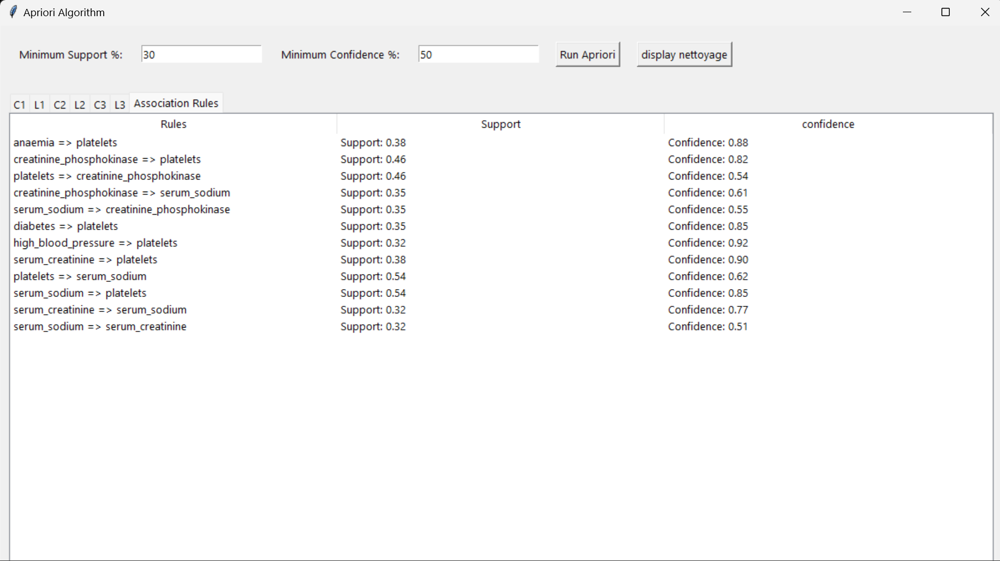
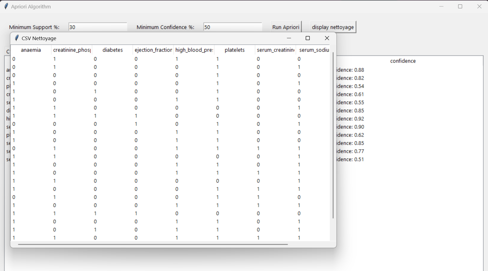

# Apriori Algorithm Implementation with GUI

This project implements the Apriori algorithm for mining frequent itemsets and generating association rules. It includes a graphical user interface (GUI) built using `Tkinter` to interact with the algorithm and display the results.

---

## Features

- **Data Preprocessing**: Automatically preprocesses a dataset of heart failure clinical records for analysis.  
- **Apriori Algorithm**: Implements the Apriori algorithm to find frequent itemsets and association rules.  
- **Interactive GUI**: 
  - Input minimum support and confidence values.
  - Run the Apriori algorithm.
  - View the results in neatly organized tables.
  - Display a cleaned version of the CSV dataset.
- **Error Handling**: Provides clear error messages for invalid inputs or missing data.
- **Customizable Results**: Outputs association rules to a text file (`output.txt`).

---

## Requirements

### Python Libraries:
Ensure the following Python libraries are installed:
- `pandas`
- `tkinter` (built-in for Python)
- `itertools`

You can install any missing libraries using `pip`:
```bash
pip install pandas
```

---

## How to Run the Project

1. Clone the repository:
   ```bash
   git clone https://github.com/your-username/apriori-python.git
   ```
   
2. Navigate to the project directory:
   ```bash
   cd apriori-python
   ```

3. Place the dataset (`heart_failure_clinical_records_dataset.csv`) in the root directory.

4. Run the script:
   ```bash
   python script_name.py
   ```

---

## User Guide

### Steps:
1. Enter **Minimum Support** and **Minimum Confidence** percentages in the input fields.
2. Click **Run Apriori** to execute the algorithm.
3. View:
   - Frequent itemsets in the `C` and `L` tables.
   - Association rules under the **Association Rules** tab.
4. Click **Display Nettoyage** to view the cleaned dataset in a separate window.

### Notes:
- **Output File**: Rules are saved in `output.txt` for further reference.
- Support and confidence values must be between 0 and 100.

---

## File Structure

```
apriori-python/
├── Apriori algorithm.py                   # Main Python script with the GUI and algorithm implementation
├── Capture1.png  #Main Window
app screenshot 1
├── Capture2.png  # Cleaned Dataset Display
app screenshot 2
├── heart_failure_clinical_records_dataset.csv  # Dataset for preprocessing
├── output.txt                       # Generated output for association rules
└── README.md                        # Project documentation
```

---

## Screenshots

### Main Window


### Cleaned Dataset Display


---

## Contributions

Feel free to fork this repository, make changes, and submit pull requests. Suggestions and improvements are always welcome!

---

## License

This project is licensed under the [MIT License](LICENSE).

---

Let me know if you'd like to make any edits or add specific sections!


